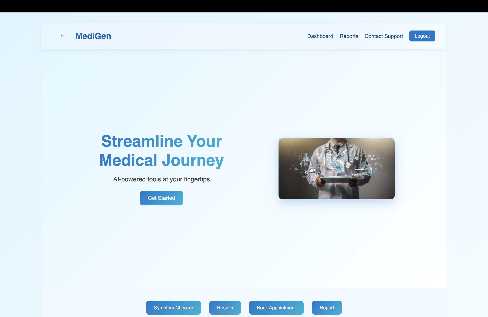
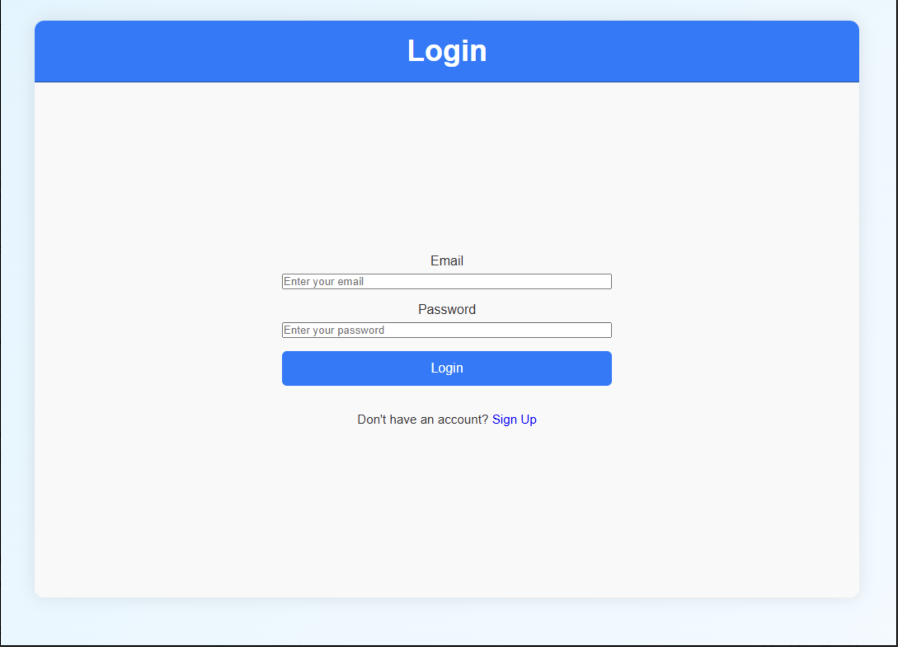
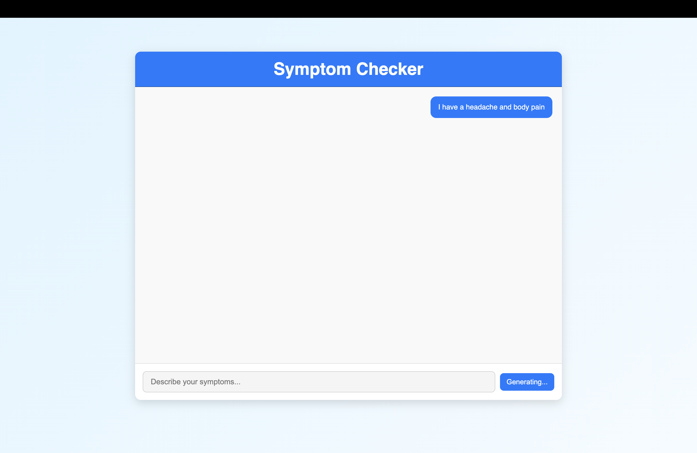
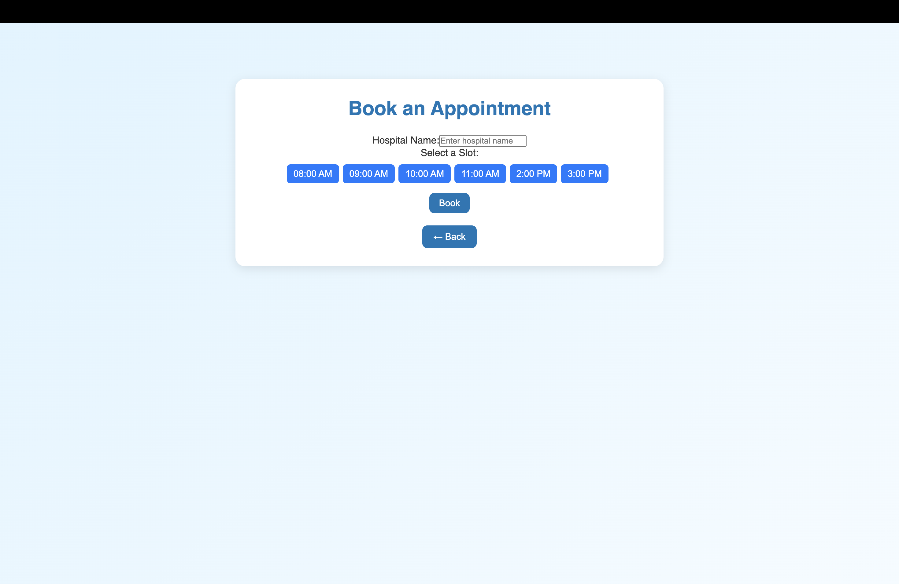
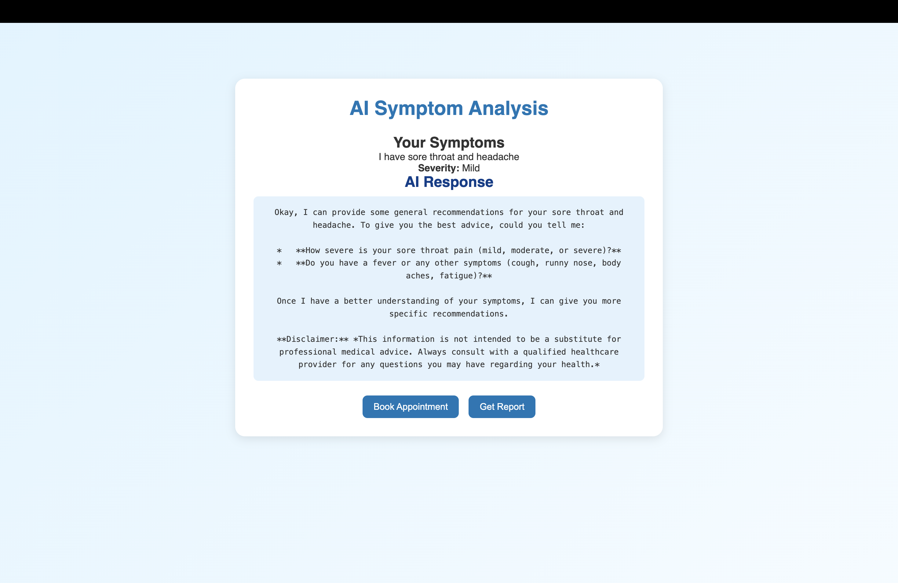

We are Quantum Quill and in this bootcamp we are going to learn how to create a GENAI and a AI Agent that helps check ur symptoms and helps in booking Appointments.

**HOME PAGE**

This is the Home page of my project, built using React. It serves as the main dashboard after login. Users can access key features like the Symptom Checker, Results, Appointment Booking, and Report pages from here. The layout includes a simple navbar, a hero section with a short tagline, and clear navigation buttons to each feature. I also used a small JavaScript fix to handle the mobile viewport height issue for a smoother responsive design.

**AUTHENTICATION PAGE**

This is our authentication page built using React. It allows users to sign up or log in to their accounts. The page connects to the backend API for authentication and stores user sessions using tokens. Once the user is logged in, they’re redirected to the main part of the app. I kept the interface simple and smooth to give a clean user experience.

**SYMPTOMCHECKER PAGE**

The Symptom Checker allows users to enter their symptoms and receive instant AI-powered analysis, helping them understand possible conditions and guiding them toward verified medical information.

**APPOINTMENT BOOKING PAGE**

This is the appointment booking page built using React. It allows users to choose a hospital, select a time slot, and confirm their booking. The page connects with the backend API using a secure token stored in local storage. Once the booking is successful, a confirmation message is shown, and users can easily navigate back to the home page.

**RESULTS PAGE**

This is the Results page built using React. It displays the AI’s analysis based on the symptoms entered by the user. The page shows the detected severity level, the AI’s response, and gives the user options to either book an appointment or generate a report. It’s designed to make the transition from diagnosis to action simple and intuitive.

------------------------------------------------------------------

**TECH STACK**

**Frontend**

React – Used for building the interactive user interface and pages like Home, Symptom Checker, Results, and Appointment Booking.

JavaScript – Powers the dynamic behavior in React components, such as form handling and viewport fixes.

CSS – For styling pages and making the layout responsive and visually appealing.

Vite – Development build tool used to run and bundle the React project efficiently.

**Backend / APIs**

Node.js – Server-side runtime to handle API requests from the frontend.

Express.js – Used to create backend routes for authentication, symptom analysis, and appointment booking.

MongoDB – Stores user data, symptoms, and appointment details securely.

JWT (JSON Web Tokens) – Handles user authentication and session management securely.

AI / Machine Learning

Generative AI (GenAI) – Provides instant symptom analysis based on user input.

AI Agent – Integrates with backend to guide users in checking symptoms and booking appointments.

Others / Utilities

npm – For managing project dependencies.

Git / GitHub – Version control and remote repository hosting for collaboration.

------------------------------------------------------------------

Deployed frontend - https://gen-ai-bootcamp-two.vercel.app/
